# GHAS-MBU-ENG

This is markdown file for Github Advanced Security Hands-on Demo 

Date :- 31-08-2023 
Presenter: Shubhendu

*Prerequisites*:
   - GiHub Actions & Workflow
   - GitHub Enterprise Cloud/ Enterprise Server Account 
   - Personal/ Organisation authentication techniques 

## Objective:
    - Github Advance Security Definition 
    - Purpose of Specific GHAS Features
    - Roles involved in securiy workflow
    - The Best practice recognisation, for identifying & responding to security vulberabilities

## Define : GitHub Advanced Security 

Suite of tools and features that gives the ability to identify security vulnerabilities in

: Supply Chain 
: Code
: Environments

1. Supply Chain: 

- Integration with 3rd party tools or open source libraries/software.
- componets which are not produced by organistion itself aka Dependencies are more vulnerable, we need to **actively review each one of them** 

eg: Log4j Year 2021

**GitHub Supply chain Mangement**

- GitHub provides automated features that flags vulnerable dependencies
- Alert to the specific Team member mentioning potential dangers 
- Helps in Vulnerability mitigation 
- Automate the process that monitors and secures project dependencies and searches for vulnerabilities 

Demo : Security Overview 

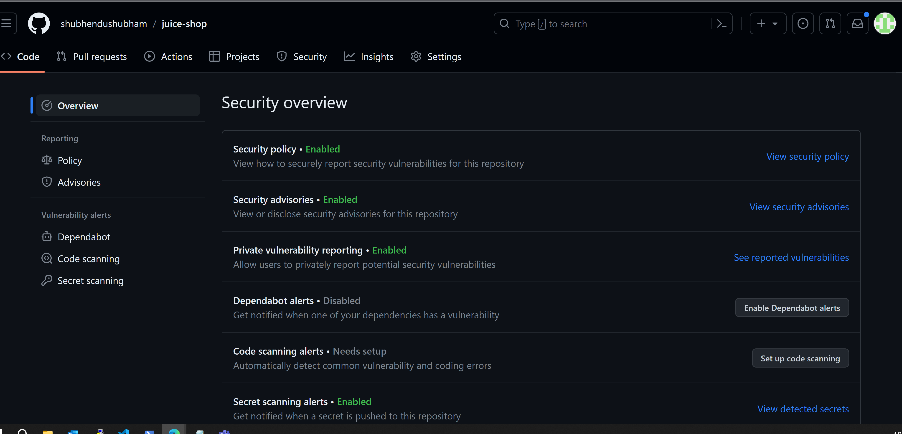

Features:
 
 * Central location to monitor the state of project dependencies
 * Allows to identify problematic repository
 * Help to understand criticality of depndencies 
 * View, Fileter and sort automated security features from the security alerts generated for organisation/ specific team.

## Code Scan

* Code Scan API 

Let's understand the SDLC

## Traditional Approach aka "Security As Gate" :- 

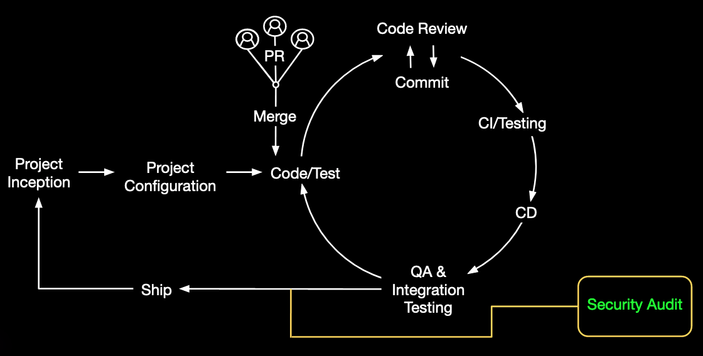

Image source : Microsoft Doc

**Issue**:

* Single security Test 
* Series of security Test only at Quality-Assurance phase
* Bottle Neck in software shipment 

## New Approach: Security Towards Left 

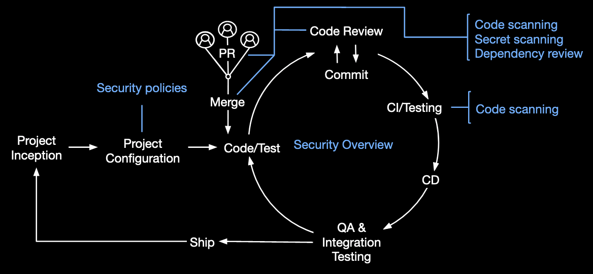

Image source: Microsoft Doc

**Benefits**: 

* Code scanning scans for potential vulnerabilities and 
 coding errors at every commit and merge.

* Secret scanning also scans for tokens and private keys that might have been accidentally committed at every commit and merge.

* Dependency review keeps track of the project dependency changes and their impact on the project security by comparing the repository manifest files to the databases of known vulnerabilities at every pull request.

Demo: Enabling Features

 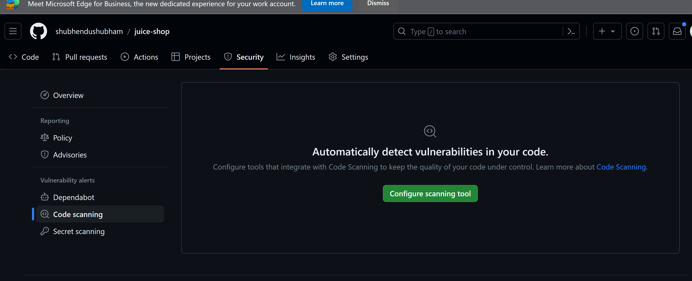 

code scan setup 

 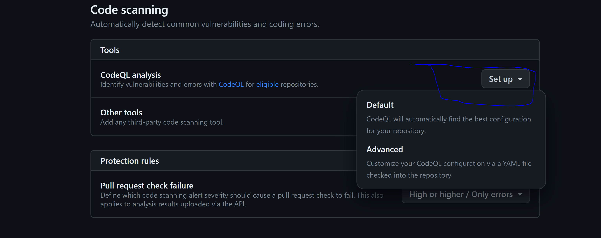

 3
 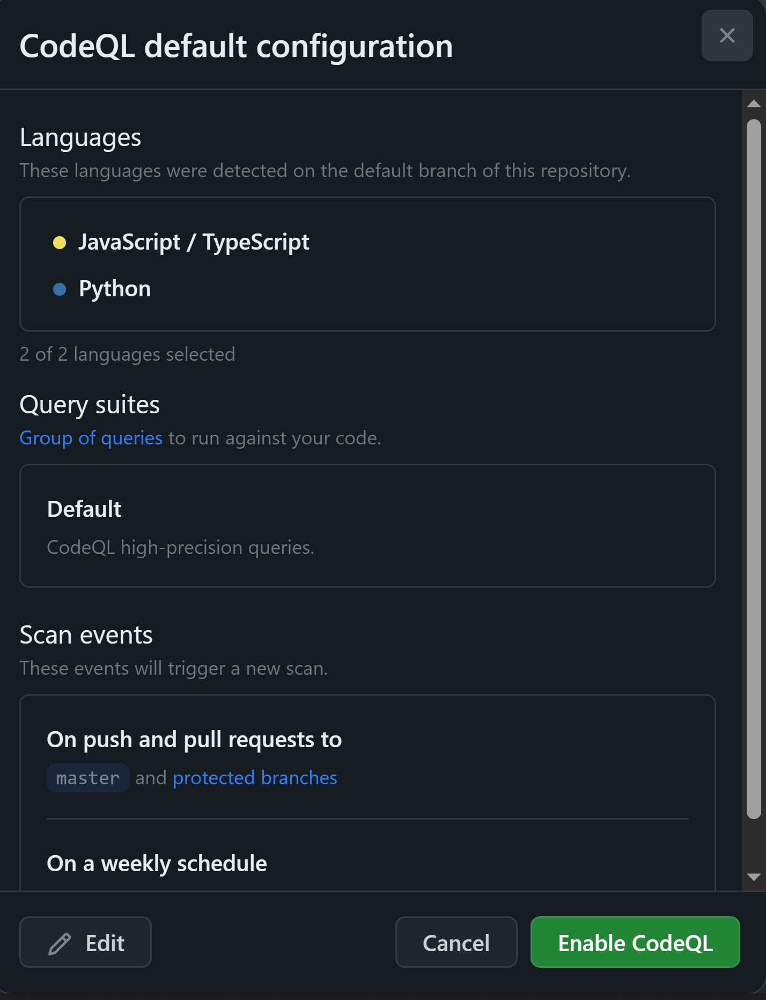

 Scan Result 

 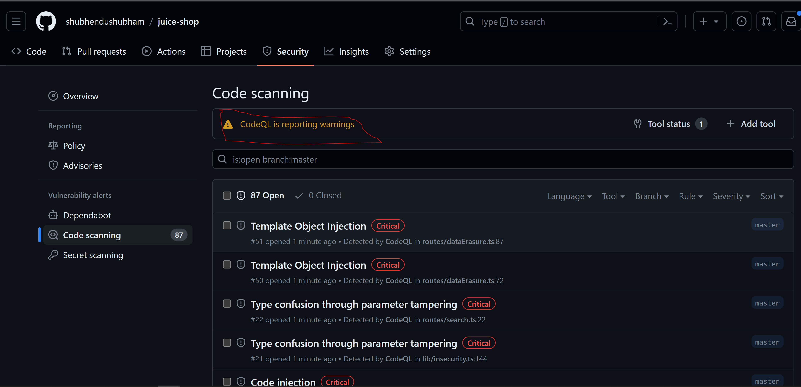

 Search
 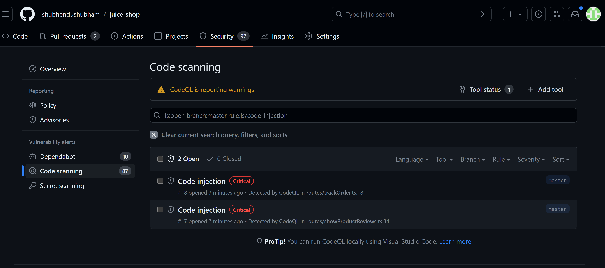

 Workflow

 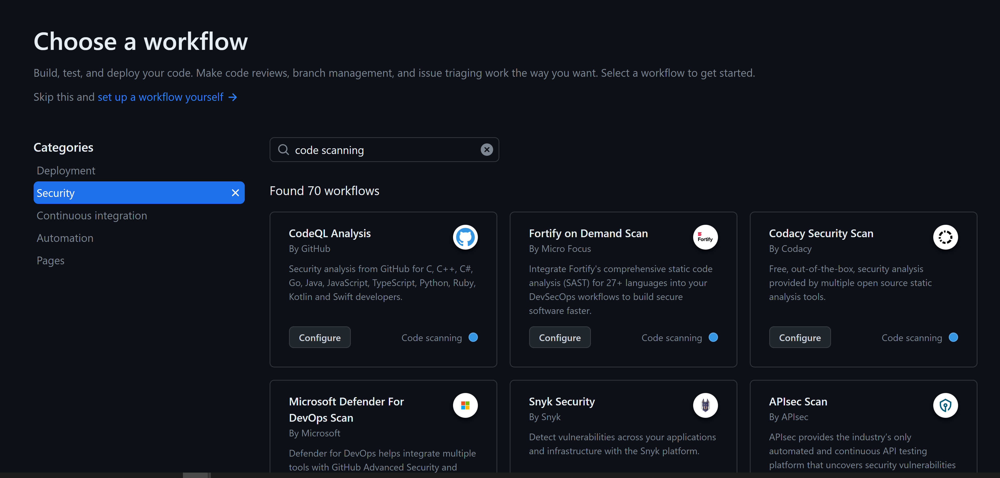

 CodeQl YML 

 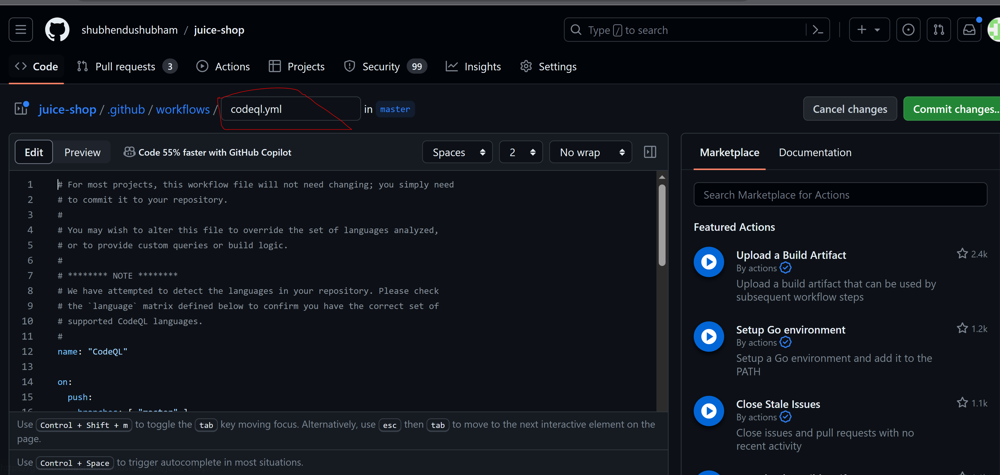

 ## Secret Scanning

* Repo API
* Secret Scanning API

Result 

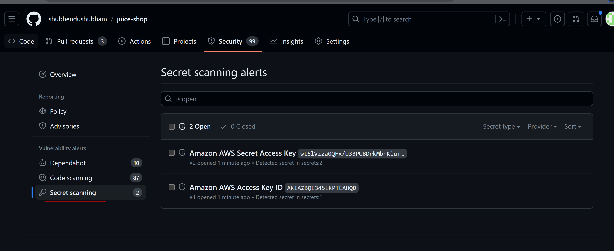

## Dependent BOT

Alerts Overview 

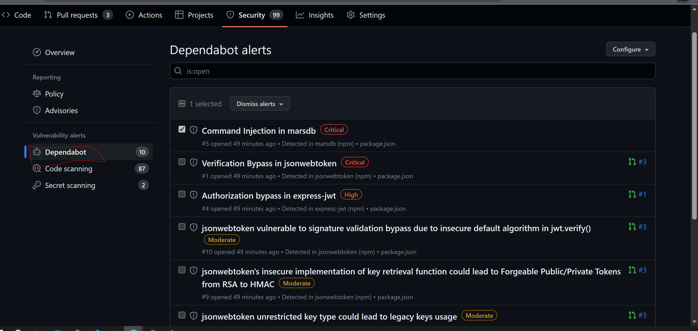

Managing Alerts 

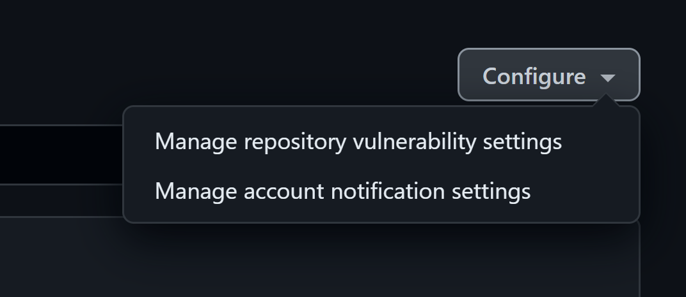

Closing/ Tag Alerts 

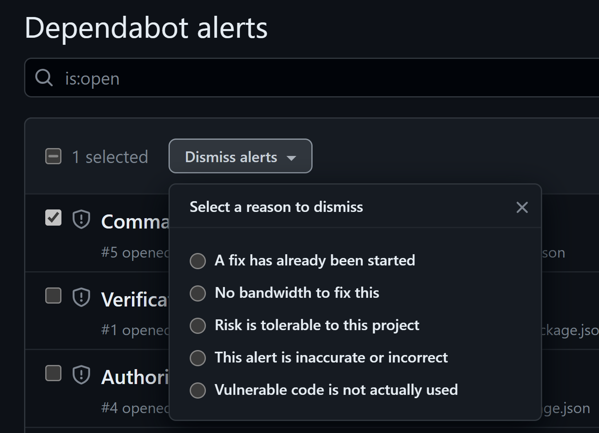

## Points to Consider

* Security Overview Feature is only available on private repos with GitHub Advance Security

* One can enable GitHub Advanced Security for all the private and internal repositories in your organization in its Code and security settings.
